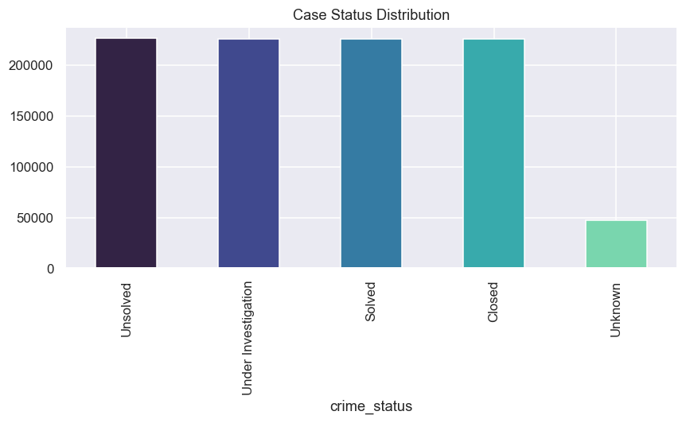
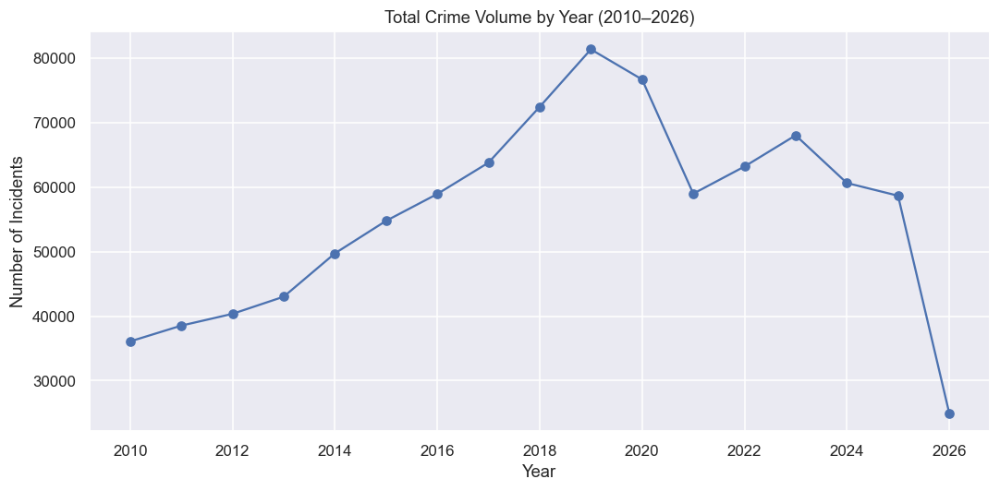
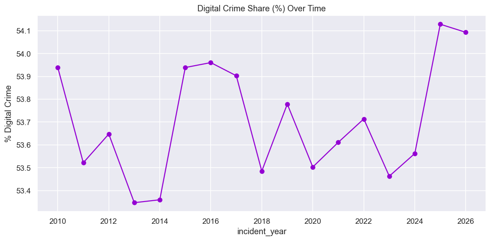
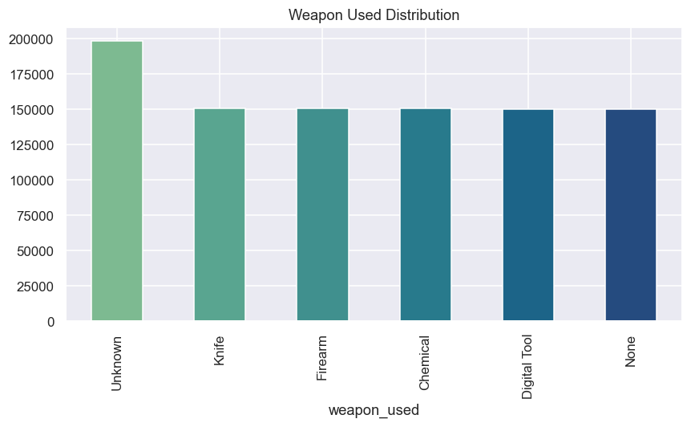

# Global_Crime_Record_Dashboard

**End-to-end crime analytics project** covering 950,000 synthetic crime records across 7 countries (Germany, India, USA, Japan, China, Russia, Canada) from 2010 to May 2026. Built to simulate a real analyst workflow — from messy raw data through SQL cleaning, Python EDA, KPI validation, and a 5-page interactive Power BI dashboard.

## 🎯 Project Goal
Analyze global crime trends, severity patterns, resolution/enforcement effectiveness, financial impact, and cross-border/digital crime dynamics across 7 countries — surfacing insights a law enforcement or policy analytics team might actually track.

## 🧰 Tech Stack
- **Data Generation:** Python (pandas, numpy, faker)
- **Database:** MySQL
- **Cleaning:** SQL (MySQL Workbench)
- **EDA & KPI Validation:** Python (pandas, matplotlib, seaborn)
- **Dashboard:** Power BI Desktop
- **Version Control:** Git / GitHub

## 📁 Repository Contents
```
├── data_generation/
│   └── Data_Generator.py   # Synthetic data generator + MySQL export
├── sql/
│   ├── 01_case_resolution.sql
│   ├── 02_crime_incident.sql
│   ├── 03_financial_digital.sql
│   ├── 04_victim_suspect.sql
├── python_eda/
│   ├── Global_Crime_EDA.py                   # Full EDA (9 sections, 21 visuals)
│   └── KPI_Calculation.py        # Standalone KPI validation script
├── dashboard/
│   ├── Global_Crime_Record_Dashboard.pbix             # Interactive Power BI dashboard
│   └── Global_Crime_Record_Dashboard.pdf              # Static preview
└── README.md
```
##### Note:
- No Cleaning was done on the Dimension Table Files i.e., Date Country & Dim Crime Type.
- As They were created with unique Country Name, Crime Type etc.

## 🗂️ Data Model (Star Schema)
**Fact tables** (950,000 rows each, joined on `crime_id`):
- `crime_incident_fact` — date, location, crime type, severity
- `victim_suspect_fact` — victim/suspect counts, arrest status, weapon used
- `case_resolution_fact` — case status, duration, reporting agency
- `financial_digital_fact` — financial loss, digital/cross-border flags

**Dimension tables:** `dim_country`, `dim_crime_type`, `dim_date`

## 🧹 Data Cleaning & Quality
The raw dataset was intentionally generated with realistic messy data — mixed date formats, inconsistent casing/typos, duplicate IDs, nulls, and outliers — then cleaned in SQL:

- **Deduplication** via `ROW_NUMBER()` (raw ~973K rows → clean 950,000)
- **Standardization** of country names, crime types (100+ typo variants), and severity labels
- **Outlier handling**: invalid severity scores, negative counts, and extreme financial values flagged and corrected
- **Null imputation** (grouped averages, not blanket fills) with audit `_imputed_flag` columns for every derived value:

| Column | Nulls | Treatment |
|---|---|---|
| `weapon_used` | 47,500 | Imputed → `'Unknown'` |
| `victim_count` | 47,106 | Imputed → avg by `weapon_used` |
| `suspect_count` | 38,000 | Imputed → avg by `crime_type` |
| `crime_status` | 47,500 | Imputed → `'Unknown'` |
| `financial_loss_usd` | 34,939 | Imputed → avg by `crime_status` |
| `case_duration_days` | 47,113 | **Left null intentionally** — represents cases still open/unresolved |

## 📊 Key Findings
- **Total Crimes:** 950,000 across 7 countries, 2010–2026
- **Resolution Rate:** 47.44% | **Arrest Rate:** 45.04%
- **Average Severity Score:** 5.50 / 10
- **Total Financial Loss:** ~$30.2B (avg $49.4K per financial crime)
- **Digital Crime Share:** 53.69% | **Cross-Border Crime Share:** 21.55%
- Crime volume shows a realistic rise-peak(2018–19)-dip-recovery pattern rather than flat/random distribution
- Country-specific crime-type weighting reflects designed patterns (e.g., China/Russia skew toward cyber/espionage; India/USA skew toward drug trafficking/robbery)

## 📈 Dashboard — 5 Pages
1. **Executive Overview** — headline KPIs, volume trend, crime type & severity breakdown
2. **Country Deep Dive** — per-country comparison, trend lines, resolution/arrest rates
3. **Crime Type Analysis** — distribution, severity mix, financial loss by type
4. **Geospatial Mapping** — interactive bubble map, city-level density, cross-border patterns
5. **Financial & Digital Crime Focus** — loss trends, distribution, digital/cross-border overlap

## 🔍 EDA Visuals 
### Crime Status Distribution

### Crime Volume By Year

### Digital Crime Tread

### Weapon Used Distribution


## 🛠️ Notable Engineering Decisions
- **Tool pivot:** Originally built in Tableau, switched to Power BI mid-project after hitting local hardware memory limits (8GB RAM) with 950K-row relationships — a real infrastructure tradeoff decision, not a shortcut.
- **Star schema over one flat table** — mirrors real BI architecture, keeps each fact table at a clean, independent grain.
- **No blanket imputation** — every filled value uses a statistically grounded method (grouped averages) and is flagged for traceability; genuinely unknowable values (like open case durations) are left null rather than fabricated.

## ▶️ How to Reproduce
1. Run `data_generation/crimepulse_generate_and_export.py` (requires MySQL + SQLAlchemy) to generate and load the raw star schema.
2. Run the SQL scripts in `sql/` sequentially to clean and impute.
3. Run `python_eda/crimepulse_eda.py` for exploratory visuals, then `crimepulse_kpi_calculation.py` to validate KPIs.
4. Open `dashboard/Global_Crime_Record_Dashboard.pbix` in Power BI Desktop to explore interactively.

## 👤 Author
**Abishek** | Aspiring Data Analyst | 📍 Gurgaon, India


[](https://www.linkedin.com/in/abishek28m/)
[](https://github.com/Shadow-Monarch28?tab=repositories)

---

## 🏷️ Tags
`#DataAnalytics` `#PowerBI` `#Python` `#MySQL` `#CrimeAnalytics`
`#GeospatialAnalysis` `#DataCleaning` `#SQL` `#PublicSafety` `#DataVisualization`
`#PortfolioProject` `#DataScience` `#BusinessIntelligence`
